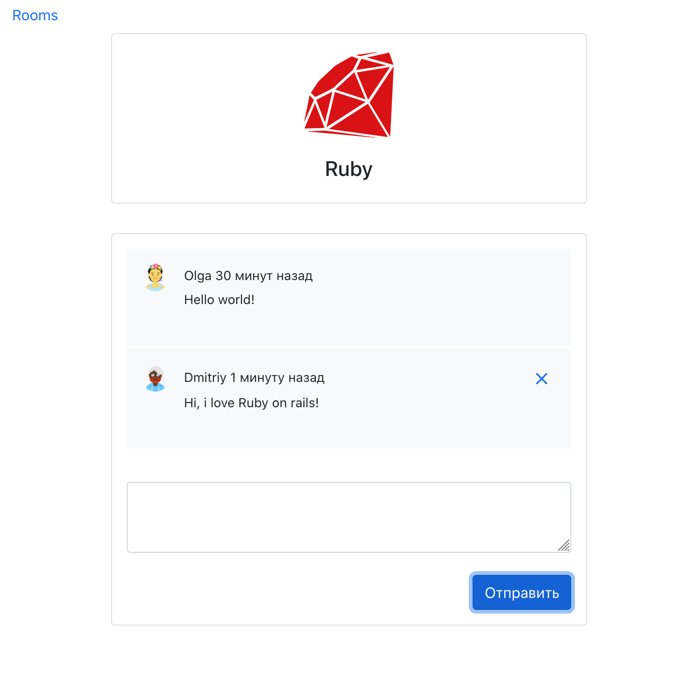

## Hackaton project SPA
[https://dmtrack.github.io/webChat/](https://dmtrack.github.io/webChat/)

### Description
This project is a test-task for the company. 
It is a webChat where you can talk with other users in single session
After you close a browser's tab - you should re-login again

### Stack
+ JavaScript
+ React hooks
+ React Routes
+ PropTypes
+ Bootstrap UI
+ Fake API

### Preview

